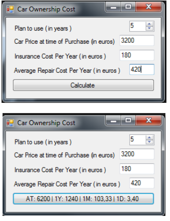

# car-ownership-cost.

Simple Application	that calculate Car Ownership Cost.

User has to	put	following input	in order to	calculate the Car’s	Ownership Cost:	
* How many years plan to use the Car?
* How much to pay to purchase the Car?
* Average Insurance Cost per year.
* Average Repair Cost per year.

